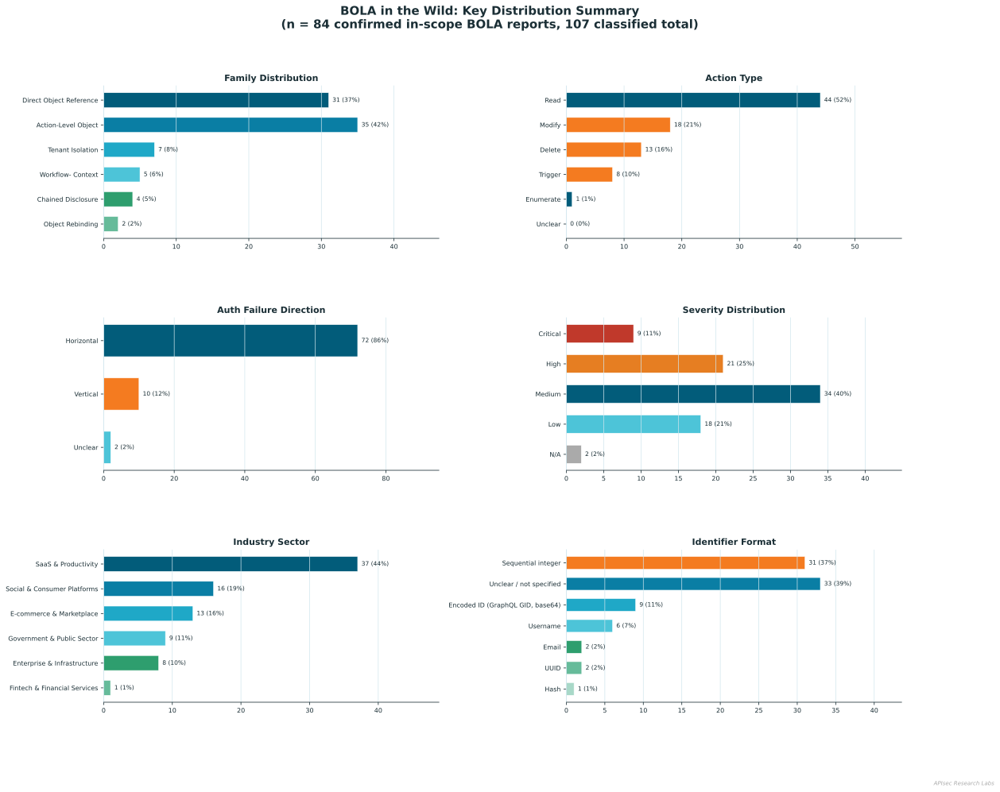

# BOLA in the Wild: Taxonomy and Empirical Analysis of 100+ HackerOne Disclosures

> **Paper:** *Broken Object Level Authorization in the Wild: An Empirical Taxonomy from 100+ Bug Bounty Disclosures*

> **Author:** Bandana Kaur
> **Affiliation:** APIsec Research Labs

[arXiv Preprint](https://arxiv.org/pdf/2605.25865)

Broken Object Level Authorization (BOLA) remains one of the most prevalent and impactful API security failures, yet real-world empirical research on how BOLA manifests in production systems remains limited. This repository accompanies our empriical analysis of 100+ public HackerOne disclosures, introducing a seven-family BOLA taxonomy and a reproducible analysis pipeline for studying authorization failures across modern applications. The dataset, prompts, figures, and scripts included here support full reproduction of the paper’s reported findings. 

 
---

## Key Findings

| Finding | Value |
|---|---|
| HackerOne candidates sampled | 200 |
| Reports fully classified | 107 |
| Confirmed in-scope BOLA | **84 (78.5%)** |
| Action-Level Object BOLA (largest family) | **41.7%** |
| Direct Object Reference BOLA | 36.9% |
| Vertical privilege cases | 11.9% |
| Out-of-scope under strict criteria | ~21.5% |

**Action-Level Object BOLA, characterised by unauthorized state-changing operations on another user's object, leads the distribution ahead of the classic direct-reference pattern.** Standard read-access testing misses the single largest real-world BOLA family.
Other things we found:
- **Sequential integers** are still the most common identifier type in 2021–2026 disclosures from mature programs (36.9% of known-format cases)
- **Non-sequential IDs don't eliminate risk**: encoded IDs, UUIDs, emails, and usernames account for 39.2% of known-format reports
- **11.9% of BOLA is vertical** (lower-privilege user acting on admin-owned objects), almost entirely absent from practitioner playbooks
- **~39% of HackerOne IDOR/IAC-tagged reports** don't meet strict BOLA criteria; raw tag counts overstate the signal significantly

---
## The Six Confirmed BOLA Families

```
Action-Level Object BOLA     ████████████████████  41.7%   n=35
Direct Object Reference      ████████████████      36.9%   n=31
Tenant Isolation             ████                   8.3%   n=7
Workflow-Context             ██                     6.0%   n=5
Chained Disclosure           █                      4.8%   n=4
Object Rebinding             ▌                      2.4%   n=2
```

Each family has an operational definition, distinguishing criteria for adjacent families, and real report examples. Full definitions are in the paper (Section 4) and encoded in `prompts/classifier_prompt.txt`.

---

## Repository Structure

```
├── README.md
├── requirements.txt
├── .gitignore
│
├── data/
│   ├── raw/
│   │   ├── candidates_raw.json
│   │   └── classified_manually_verified.json
│   │
│   ├── schema/
│   │   ├── dataset_schema.md
│   │   ├── taxonomy_definition.md
│   │   └── inclusion_exclusion_rules.md
│   │
│   └── DATASET_INFO.md
│
├── prompts/
│   ├── candidate_prefilter.md
│   └── classifier_prompt.txt
│
├── src/
│   ├── pipeline/
│   │   ├── 01_fetch_candidates.py
│   │   ├── 02_fetch_eligible_reports.py
│   │   └── gather.py
│   │
│   └── analysis/
│       ├── loader.py
│       ├── analysis.py
│       ├── figures.py
│       ├── config.py
│       └── main.py
│
├── outputs/
│   ├── figures/
│   │   ├── fig_overview_dashboard.png
│   │   ├── fig_family_bar.png
│   │   ├── fig_hv_bar.png
│   │   ├── fig_action_bar.png
│   │   ├── fig_scope_pie.png
│   │   ├── fig_confidence_pie.png
│   │   ├── fig_family_sector_heatmap.png
│   │   ├── fig_family_severity_heatmap.png
│   │   ├── fig_temporal_bar.png
│   │   └── fig_mechanism_bar.png
│   │
│   └── tables/
│       ├── family_distribution.csv
│       ├── action_distribution.csv
│       ├── hv_distribution.csv
│       ├── sector_distribution.csv
│       ├── id_format_distribution.csv
│       ├── severity_distribution.csv
│       ├── temporal_distribution.csv
│       ├── confidence_distribution.csv
│       ├── family_x_sector_crosstab.csv
│       └── family_x_severity_crosstab.csv
│
└── docs/
    ├── inclusion_exclusion_rules.md
    ├── taxonomy_definition.md
    └── limitations.md

```

---

## Reproducing the Results

```bash
git clone https://github.com/hackwither/bola-in-the-wild
cd bola-in-the-wild
pip install -r requirements.txt
python src/analysis/main.py
```

All figures and summary statistics in the paper are reproduced by `main.py` from `data/raw/classified_manually_verified.json`.

---

## Citation

```bibtex
@techreport{kaur2026bola,
  title        = {Broken Object Level Authorization in the Wild: An Empirical Taxonomy from 100+ Bug Bounty Disclosures},
  author       = {Kaur, Bandana and Haro Peralta, Jose},
  institution  = {APIsec Research Labs},
  year         = {2026}
}
```
